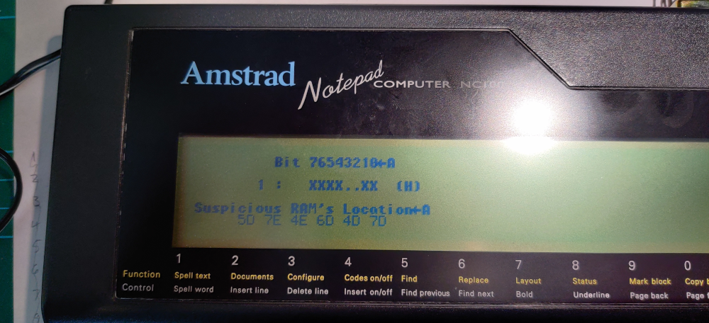

# Epson PX8 (and PX4?) RAM Test

This is a RAM diagnostics for the Epson PX8 (and probably PX4) portable computers.

I do not know who the author of this is, I obtained it from [this excellent website](https://fjkraan.home.xs4all.nl/comp/px8/) here [RAMTEST.zip](https://fjkraan.home.xs4all.nl/comp/px8/roms/RAMTEST.zip)

Unfortunately it comes with next to no instructions!

To figure out how it works I trawled through the disassembly and cross referenced with the PX8 technical manual to come up with the [annotated disassembly](DRAMtestV10_PX4-PX8.txt) in this repo. It may not be 100% but was good enough for what I needed.

Early on it looks like a test is performed to determine whether the machine is a PX8 or PX4. I only analysed the PX8 path but presumably it will work in the same manner on a PX4.

## Usage

* Write the [binary](px8_memtest_ghidra/DRAMtestV10_PX4-PX8.bin) to EPROM.
* Install in place of the OS ROM (under the small hatch on the bottom).
* Attach a terminal connection between the PX-8 RS232C connector and your terminal host computer.
* Configure terminal; 4800 baud, 8 data bits, odd parity, 2 stop bits
* Power on the PX8.
* Press the PX8 Initial Reset switch (in the ROM compartment).

The result of the memory test is output to the attached terminal;

* A bit field showing in which bits errors have been detected (X=error, .=ok)
* A list of the RAM ICs (as labeled on the PCB silk screen) that are associated with the erroneous bits.

Here's an example identifying 6 bad chips on one of my PX8 (using the terminal app on an NC100);

### Cable Notes

The test ROM checks the RS232C DSR signal before transmitting any data, so make sure that your cable includes this signal (or at least asserts it).

